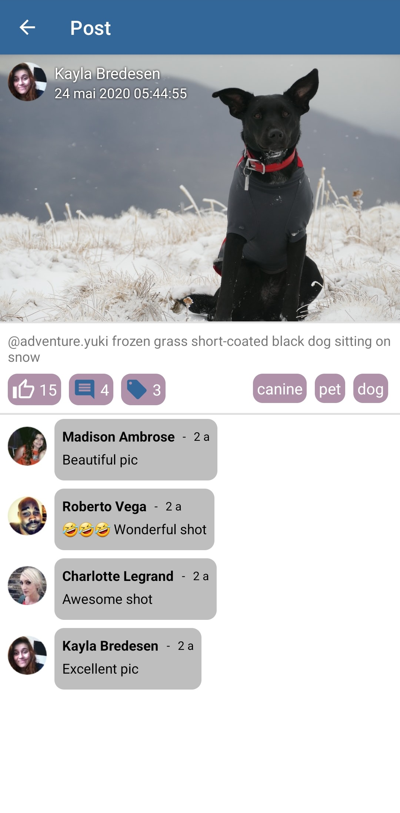
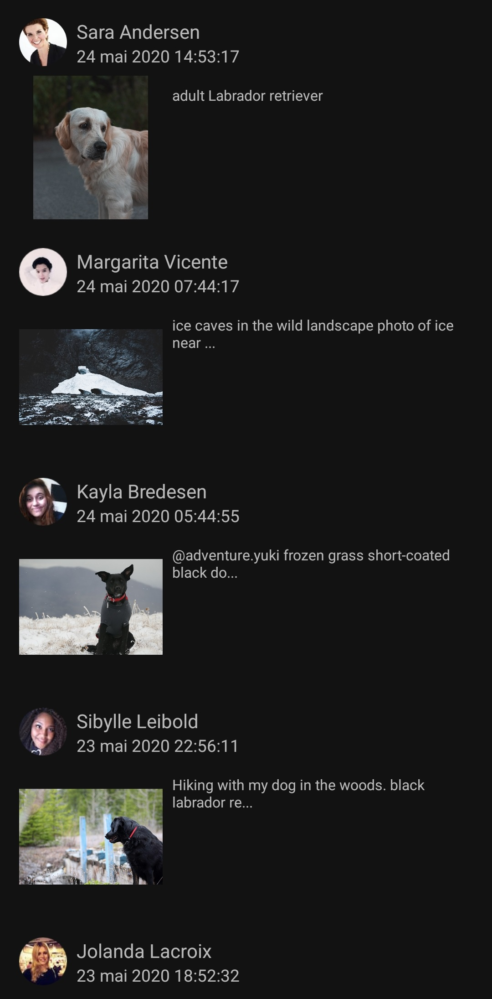
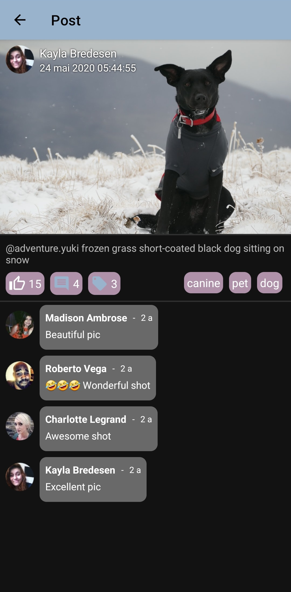
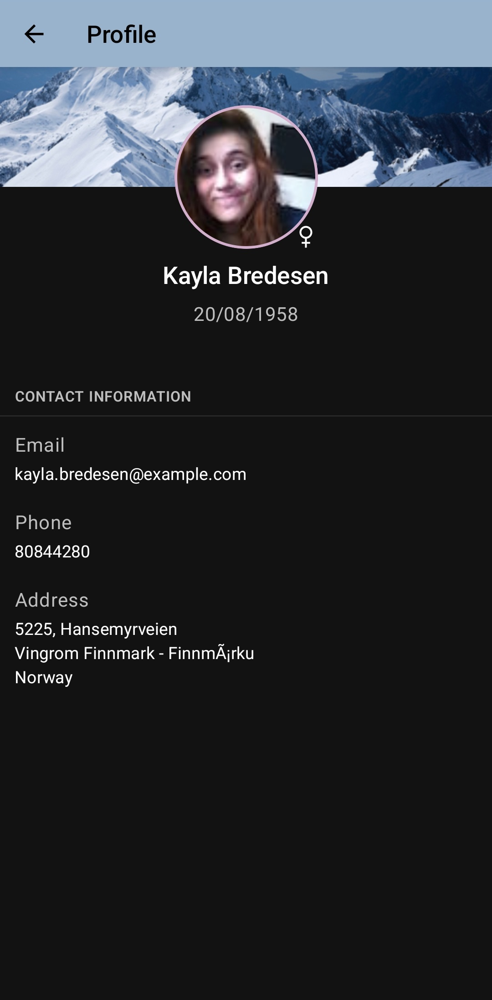

# SocialProfile

This application is an exercise to learn different technical points. It features posts of dog pictures commented by users.

## I) Main features

This application is divided into 3 main screens :
- **home** : A list of posts is displayed. A post consists in a animal picture (mainly dog) with an extract of the description posted by a user at a certain date.
- **post** : With the details of the post: the big picture, the full description the likes, the comments (displayed or not) and the tags (displayed or not). It can be open by clicking on the picture in the home screen
- **user** : With the personal information of the user. It can be open from any click on the user picture (either from home or post screen.


| home screen | post screen | user screen |
|:-----------:|:-----------:|:-----------:|
|  |  |  |
|  |  |  |

## II) Technical points

### 1) Multi-module project
Gradle allows to segment the code with **multi-module**. The modules are the following :
- **:api:**: An API client that uses the library [retrofit](https://square.github.io/retrofit/)
- **app**: The base module that handles the navigation between the features and that contains the configuration of the application
- **buildSrc**: A reserved module that contains build data
- **core**: A module that contains methods used by some other modules such as `DateExtensions` or `BitmapExtensions`
- **home**: A feature module that contains the first view: a list of posts 
- **user**: A feature module that displays the profile of a given user

Also one of the biggest challenge I had was to navigate between the feature modules. 
It should be done in the :app module to avoid dependency between the submodules.
I achieved that by using nested graphs and deeplink. Also a challenge was that I wanted view-based and compose modules.

Here are the android developer articles I read on [multi-module](https://developer.android.com/guide/navigation/navigation-multi-module), [deep-link](https://developer.android.com/guide/navigation/navigation-deep-link) and [interoperability](https://developer.android.com/jetpack/compose/navigation#interoperability) of navigation. 

```kotlin
// const val NAVIGATION = "2.5.1"
implementation("androidx.navigation:navigation-runtime-ktx:${Versions.NAVIGATION}")
implementation("androidx.navigation:navigation-fragment-ktx:${Versions.NAVIGATION}")
```

### 2) Clean Architecture
This application tend to implement a **clean architecture**

```kotlin
// const val HILT = "2.41"
implementation("com.google.dagger:hilt-android:${Versions.HILT}")
kapt("com.google.dagger:hilt-android-compiler:${Versions.HILT}")
```

### 3) Hybrid UI components
To cover a large variety of UI I chose to have an hybrid UI, meaning XML view-based components and compose components:

#### a) XML view-based components 
The list of posts is displayed in a `RecyclerView` with a `ListAdapter`. Here are the useful links I used on [Medium](https://medium.com/geekculture/android-listadapter-a-better-implementation-for-the-recyclerview-1af1826a7d21) and on the [official Android doc](https://developer.android.com/reference/androidx/recyclerview/widget/ListAdapter)
For the `DiffUtil.ItemCallback` I read this article on [Medium](https://jermainedilao.medium.com/demystifying-diffutil-itemcallback-class-8c0201cc69b1)

The screen with the post content contains a `chain` in a `ConstraintLayout`. I used these great tutorials on [Medium](https://medium.com/@nomanr/constraintlayout-chains-4f3b58ea15bb) and on [constraintLayout.com](https://constraintlayout.com/basics/create_chains.html)

```kotlin
implementation("androidx.core:core-ktx:1.8.0")
```

#### b) Compose components

If your new to compose I recommend you to read [this](https://developer.android.com/jetpack/compose/layouts/basics) and [that](https://developer.android.com/jetpack/compose/layouts/material) from the official android doc

The `Scaffold` are one useful tool provided by Jetpack Compose, to understand it here is an article from [jetpackcompose.net](https://www.jetpackcompose.net/scaffold) and one 

Also to know how to handle lists and grids (similarily to the `RecyclerView`). I recommend to read [this](https://developer.android.com/jetpack/compose/lists)

```kotlin
// const val COMPOSE = "1.2.0-alpha08"
implementation("androidx.compose.compiler:compiler:${Versions.COMPOSE}")
implementation("androidx.compose.runtime:runtime-livedata:${Versions.COMPOSE}")
implementation("androidx.compose.material:material:${Versions.COMPOSE}")
implementation("androidx.compose.ui:ui:${Versions.COMPOSE}")
implementation("androidx.compose.ui:ui-viewbinding:${Versions.COMPOSE}")
implementation("androidx.compose.ui:ui-tooling-preview:1.1.1")
implementation("androidx.compose.ui:ui-tooling:${Versions.COMPOSE}")
```

### 4) Coroutines 

The [kotlin doc](https://kotlinlang.org/docs/coroutines-guide.html) and the [Android doc](https://developer.android.com/kotlin/coroutines)

A [great tutorial](https://proandroiddev.com/kotlin-flow-on-android-quick-guide-76667e872166) for understanding MVVM + Coroutine Flow + Retrofit 

This [great video](https://www.youtube.com/watch?v=KMb0Fs8rCRs&t) to understand the testing of coroutine. Be aware that some of the library shown here is deprecated

```kotlin
implementation("org.jetbrains.kotlinx:kotlinx-coroutines-android:1.6.4")
```